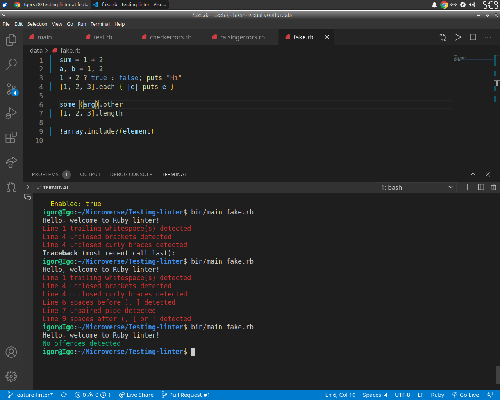
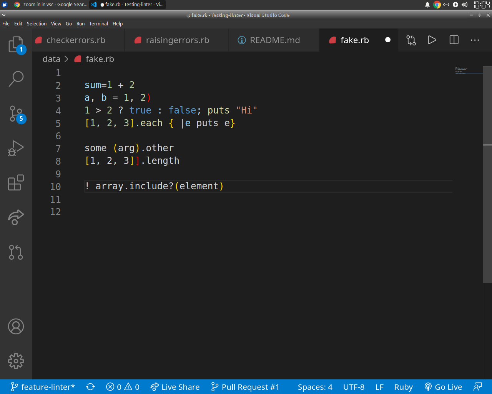

# Testing Linter

- In this project, the student builds an own customized linter for ruby files.
  The main goal is to put into practice the main concepts of Object Oriented
  Programming gained in Microverse currriculum Ruby module.



# Getting Started

- This linter will parse your file and find some errors as defined by
  [Ruby Style Guide](https://github.com/github/rubocop-github/blob/master/STYLEGUIDE.md)

# Following can be tested with this linter

- Each line of code must be of a readable length. Unless you have a reason to,
  keep lines to a maximum of 118 characters. Why 118? That's the width at which
  the pull request diff UI needs horizontal scrolling (making pull requests
  harder to review).

- There should be no trailing whitespaces left.

- There should be spaces around operators, after commas, colons and semicolons,
  around { and before }.

- There should be no spaces after (, [ or before ], ).

- There should be no spaces after !.

- There should be no unpaired |, (, ), {, }, [, ].

## Example of good code
``` ruby
sum = 1 + 2
a, b = 1, 2
1 > 2 ? true : false; puts "Hi"
[1, 2, 3].each { |e| puts e }
```


``` ruby
some(arg).other
[1, 2, 3].length
```


``` ruby
!array.include?(element)
```

## Example of bad code


## Live Demo

[Live Demo Link]()

-

## On your Computer

To get a local copy up and running follow these simple example steps.

### Prerequisites

- Any PC or device with internet connection and ability to use command line
  terminal

### Setup

- Open the command line terminal

### Install

- Go to your preferred directory
- Run `git clone https://github.com/Igors78/TicTacToe.git` command

### Usage

- Navigate to respective folder (TicTacToe) and type `bin/main` in your
  terminal.
- Follow the instructions above for the live link.

### Run tests

- Tests passed can be found [here]()

## Built with

- Ruby

## Author

👤 **Igors Oleinikovs**

- GitHub: [@githubhandle](https://github.com/Igors78)
- Twitter: [@twitterhandle](https://twitter.com/oleinikovs)
- LinkedIn: [LinkedIn](https://www.linkedin.com/in/igors-oleinikovs-17a10958/)

## 🤝 Contributing

Contributions, issues, and feature requests are welcome!

## Show your support

Give a ⭐️ if you like this project!

## Acknowledgments

- Ruby documentation
- [Ruby Guides](https://www.rubyguides.com/)

## 📝 License

This project is [UNLicense](./LICENSE) licensed.
